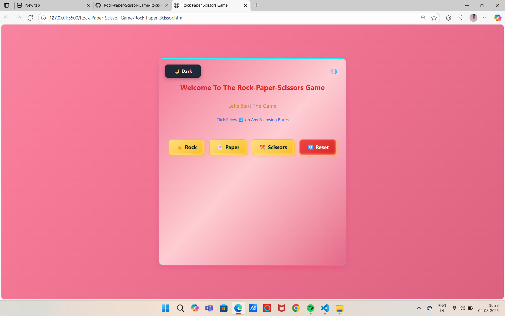
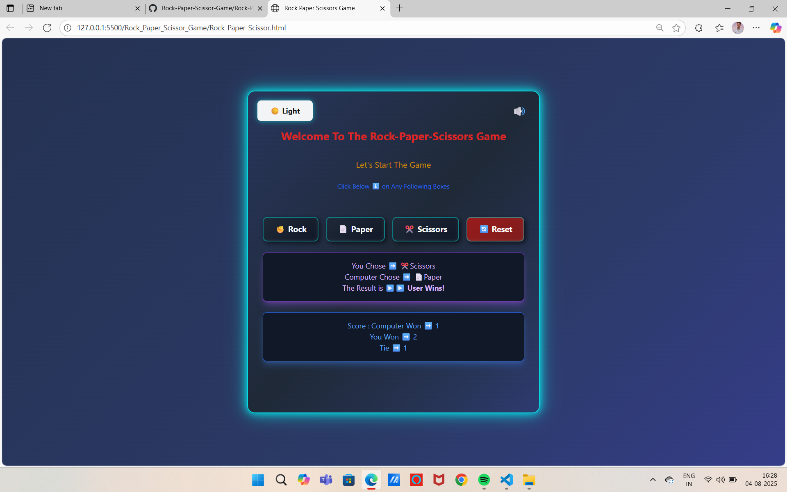

# 🪨 Rock-Paper-Scissors Game 🎮  
A fun and interactive Rock-Paper-Scissors game built using **HTML, CSS, and JavaScript**. Play against the computer, enjoy sound effects, and switch between Light & Dark mode with a modern animated UI!

---

## 🖼️ Game Preview  

| 🌞 Light Mode | 🌙 Dark Mode |
|--------------|--------------|
|  |  |

---

🔗 Live Demo  
🎮 [Play Now: Rock-Paper-Scissors Game »](https://saksham1110shankhdhar.github.io/Rock-Paper-Scissor-Game/)

---

## 🚀 Features  
- 🎲 Play Rock, Paper, or Scissors against a randomly choosing computer.  
- 📊 **Dynamic Scoreboard**:  
  - Computer Wins  
  - Your Wins  
  - Ties  
- 🔊 **Sound Effects** (click, win, lose, tie) with Mute/Unmute toggle.  
- 🌙 **Dark Mode Toggle** with smooth transitions.  
- ♻️ One-click **Reset button** to restart scores.  
- 🎨 **Modern Animated UI** (gradient backgrounds, hover effects).  
- ✅ Fully **Responsive Layout** for desktop & mobile.

---

## 🧪 Rules  
- ✊ Rock beats ✂ Scissors  
- 📄 Paper beats ✊ Rock  
- ✂ Scissors beats 📄 Paper  
- ⚖️ Same choices result in a tie.

---

## 📁 Project Structure  

📂 Rock_Paper_Scissor_Game/
├── Rock-Paper-Scissor.html    # Main game interface  
├── RPS_GAME.js                # JavaScript (logic, sound, dark mode)  
├── sounds  

🛠️ Technologies Used
Technology	Purpose
HTML	Game structure & layout
CSS	Styling, Flexbox, gradients
JavaScript	Game logic, sound effects, DOM updates

## 💻 How to Play Locally

1️⃣ Clone the repository:
git clone https://github.com/Saksham1110shankhdhar/Rock-Paper-Scissor-Game.git

2️⃣ Open the folder:
Rock-Paper-Scissor-Game

3️⃣ Launch the game:
Open Rock-Paper-Scissor.html in your browser.

## 📌 Highlighted UI Features

✅ Dark & Light Mode toggle with animated transitions.
✅ Sound effects (Mute/Unmute button).
✅ 3D-styled buttons with hover effects.
✅ Animated scoreboard with modern card design.
✅ User instructions for quick gameplay.

# 🙋‍♂️ Author
 👤 Saksham Shankhdhar
🔗 GitHub Profile »https://github.com/Saksham1110shankhdhar

