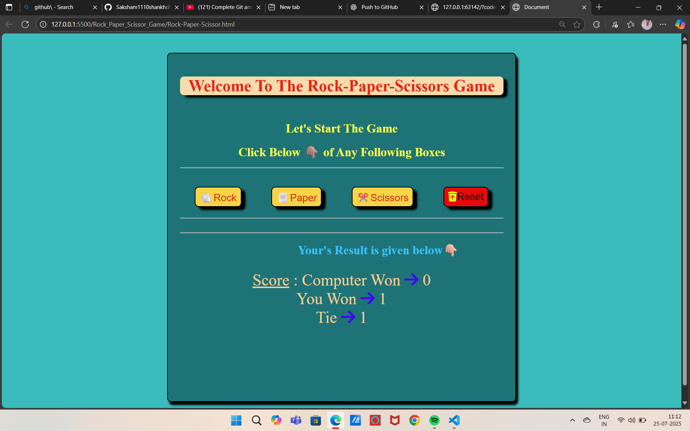

# 🪨 Rock-Paper-Scissors Game 🎮  
A classic Rock-Paper-Scissors game built using **HTML, CSS, and JavaScript**. Test your luck against the computer with a clean and colorful interface!

---

## 🖼️ Game Preview



---

## 🚀 Features

- 🎲 Play Rock, Paper, or Scissors against a randomly-choosing computer.
- 📊 Live score updates for:
  - Computer Wins
  - Your Wins
  - Ties
- ♻️ One-click **Reset** button to restart the score.
- ✅ Responsive & clean interface using Flexbox.
- 🎨 Colorful buttons and results with **shadowed cards** and bold feedback.

---

## 🧪 Rules

- ✊ Rock beats ✌️ Scissors  
- 📄 Paper beats ✊ Rock  
- ✂️ Scissors beats 📄 Paper  
- Same choices result in a tie.

---

## 📁 Project Structure

📂 Rock_Paper_Scissor_Game/
├── Rock-Paper-Scissor.html → Main game interface
├── Rock-paper-game.CSS → Styling with layout, buttons, and effects
└── RPS_GAME.js → JavaScript logic for gameplay and scoring


---

## 🛠️ Technologies Used

| Technology | Purpose                          |
|------------|----------------------------------|
| HTML       | Markup and game structure        |
| CSS        | Styling and layout (Flexbox)     |
| JavaScript | Game logic and DOM manipulation  |

---

## 💻 How to Play Locally

1. Clone the repository:
   ```bash
   git clone https://github.com/Saksham1110shankhdhar/Rock-Paper-Scissor-Game.git

2. 📁 Open the folder:
   
> cd Rock-Paper-Scissor-Game

3.Launch Rock-Paper-Scissor.html in your browser.


📌 Highlighted UI Features

- Emphasized buttons with icons (🪨 📄 ✂️ 🗑️)

- Result text: Score :, You Won, Tie with blue arrow indicators

- User guide: "Click Below 👇 of Any Following Boxes"

- Shadowed scoreboard for a modern UI look

  🙋‍♂️ Author
Saksham Shankhdhar
GitHub Profile » https://github.com/Saksham1110shankhdhar


